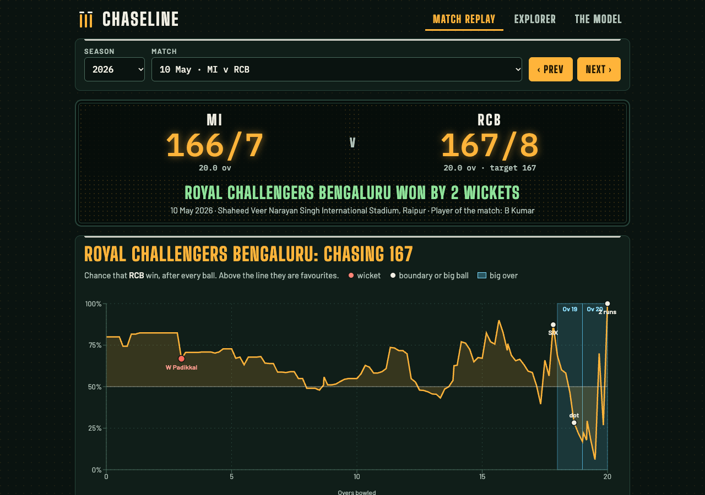
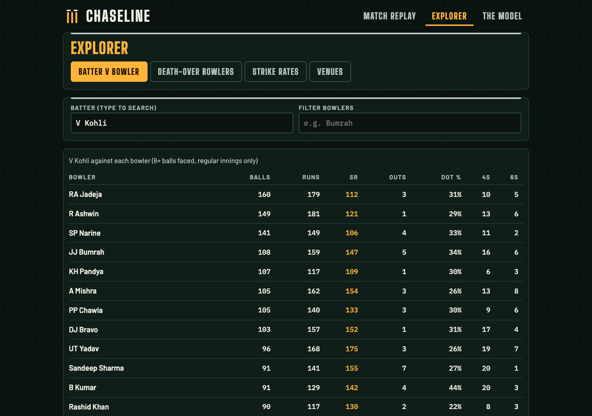
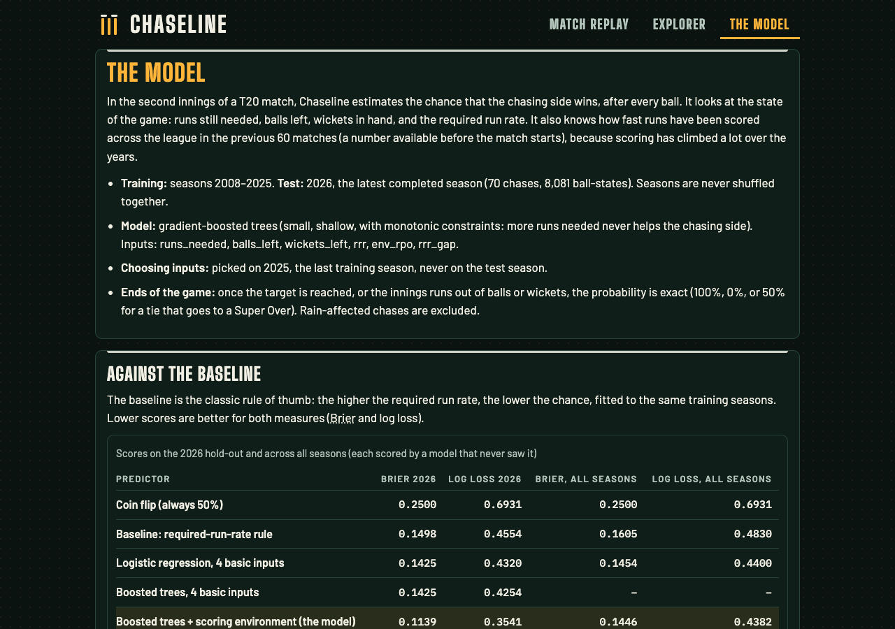
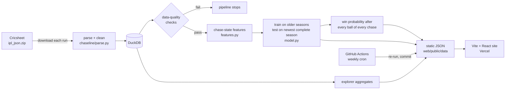

# Chaseline

**Ball-by-ball win probability for T20 chases, built on public Indian Premier League data.**

**Live site: https://chaseline.vercel.app**

[](https://github.com/Seshasai-Tunuguntla/chaseline/actions/workflows/ci.yml)



## What it does

- **Match replay.** Pick a season and a match. See the chasing side's win probability after every ball, with the
  biggest swings (wickets, boundaries, big overs) marked and listed in text.
- **Players.** Search any player for career batting and bowling by season and the bowlers they have faced most.
  Names in the Explorer tables link to profiles. The replay page also lists each season's most dramatic matches.
- **What if?** Set runs needed, balls left and wickets in hand and read off the chasing side's win probability, plus
  how one more wicket, six or dot ball would move it. Values come from a precomputed 48,000-cell table
  (`whatif.json`, about 22 KB gzipped) at the current scoring environment, interpolated in the browser.
- **Explorer.** Batter v bowler matchups, best death-over (overs 16-20) bowlers, top batters by strike rate with a
  minimum-balls filter, venue stats, and the biggest comebacks (the winner's lowest chance during the chase).
- **The model.** How the probabilities are made, how they compare with a required-run-rate baseline, a calibration
  chart, and an honest list of limits.

| Explorer | The model |
| --- | --- |
|  |  |

Mobile (375 px): [replay](docs/screenshots/replay-mobile.png), [explorer](docs/screenshots/explorer-mobile.png),
[model](docs/screenshots/model-mobile.png).

## How it is built

Everything heavy happens offline in Python. The website is static files and a small React app. No server, no hosted
database, no secrets.



- **Stack:** pandas, DuckDB, scikit-learn; Vite, React, TypeScript, Recharts; Vercel; GitHub Actions.
- **Small files:** one JSON file per match (about 4 KB), one per batter for matchups, one per player for profiles, one per season for the match
  list. A page loads only what it shows. The chart libraries are code-split.
- **Clean URLs:** `/replay/<match id>`, `/explorer`, `/player/<id>`, `/model`, served by Vercel rewrites. Old
  `/#/replay/<id>` links redirect. All exported JSON is rounded to 5 decimals, and a test checks two exports are
  byte-identical, so weekly refreshes only commit real changes.
- **Weekly refresh:** [`refresh-data.yml`](.github/workflows/refresh-data.yml) rebuilds everything on Mondays,
  fails if a data-quality check fails, and commits changed files. Vercel then redeploys.

## The model

For the second innings, Chaseline estimates the chance that the chasing side wins, from the state after each delivery:

| Input | Why |
| --- | --- |
| runs needed, balls left, wickets left | the basic state of a chase |
| required run rate | the classic summary; also the baseline's only input |
| `env_rpo`: league runs per over over the previous 60 matches (strictly earlier dates) | scoring has risen a lot; the same required rate means different things in different eras |
| `rrr_gap`: required rate minus `env_rpo` | how demanding the chase is *for the era* |

Model: small gradient-boosted trees (depth 3, 150 rounds, seed fixed) with monotonic constraints, so more runs needed
or a higher required rate never helps the chasing side. When the target is reached, or balls or wickets run out, the
probability is exact (1, 0, or 0.5 for a tie that goes to a Super Over). Rain-affected chases are left out.

**Split.** Train on seasons 2008-2025. Test on 2026, the newest complete season (it has a final). No shuffling across
seasons. Leakage is guarded by tests: features at ball *k* are identical when everything after *k* is deleted, and the
scoring environment ignores the current day and anything later. Tests also record every model fit and assert that
choosing the set-up and the hold-out fits never see 2026, and that each rolling-origin fit sees only earlier seasons.

**Results on the 2026 hold-out** (70 chases, 8,081 ball-states; lower is better):

| Predictor | Brier | Log loss |
| --- | --- | --- |
| Coin flip (always 50%) | 0.2500 | 0.6931 |
| **Baseline: required-run-rate rule** (logistic on RRR, trained on the same seasons) | 0.1498 | 0.4554 |
| Logistic regression, 4 basic inputs | 0.1425 | 0.4320 |
| Boosted trees, 4 basic inputs | 0.1425 | 0.4254 |
| Earlier version (boosted trees + scoring environment) | 0.1139 | 0.3541 |
| **Chaseline model (final)** | **0.1144** | **0.3567** |

The final model's Brier score is 0.035 better than the baseline (95% interval 0.025 to 0.046, resampling whole matches).

### Attempt to fix the 2026 under-prediction

The first version gave chasers 51% on average in 2026 while they won 63% of ball-states. I tried three fixes, with a
rule: choose **only** on the 2025 validation season, never by looking at 2026.

- **Recency-weighted training** (sample weight halves every 3 seasons).
- **An Impact Player era flag** (seasons 2023 onwards; known before any match).
- **Recalibration** (Platt or isotonic), fitted on predictions for the season before the newest training season.

All 24 combinations (with or without each fix, with the basic or scoring-environment inputs) were scored on 2025
using models trained on 2008-2024. The best was scoring environment + era flag, no weights, no recalibration
(2025 Brier 0.1239), barely ahead of the earlier version (0.1245). It was chosen, and 2026 was scored once:

**Result: the fixes did not help.** 2026 Brier 0.1144 against 0.1139 before (no meaningful difference), and mean
predicted 51% vs actual 63% is unchanged. 2025 could not tell the candidates apart, so it could not pick a fix that
works on 2026. Isotonic recalibration fitted on one season was sometimes much worse (it produces hard 0% and 100%
steps). The remaining gap is a real shift in how chases went in 2026 that nothing known by the end of 2025 predicted.

**Momentum inputs (dot balls and boundaries in the last 12 balls)** were tried on top of the best set-up and kept only
if they beat it on the 2025 validation season. They did not (Brier 0.1244 with, 0.1239 without), so the final model
does not use them.

### Rolling-origin evaluation (the honest forecasting view)

For each season from 2010, the model is trained **only on earlier seasons** and scored on that season. The model page
charts Brier score per season against the baseline. The model beat the baseline in 15 of 17 seasons (it lost in
2010 and 2019). The set-up was chosen using 2025, so only 2026 is a clean test.

**Important:** the "all seasons" numbers (model 0.1446, plain logistic regression 0.1454, baseline 0.1605, over 1,185
chases) and the replay lines use **leave-one-season-out**: each season is scored by a model trained on all the *other*
seasons, **including later ones**. That trains on the future, so it is fine for a replay and a calibration picture, but
it is not a forecasting test. Only the 2026 hold-out and the rolling-origin results train strictly on the past.

**Calibration.** Across all seasons, when the model says about 70% the chasing side wins about 70% (bins sit on the
diagonal: model 55% / actual 56%, 75% / 73%, 85% / 86%). In 2026 alone it is *under-confident for chasers*, as above.


### Limitations

- **Few independent outcomes.** About 70 chases per season; hundreds of ball-states share one result. The hold-out
  is far less certain than 8,081 rows suggest, and there is only one hold-out season.
- **It sees the scoreboard, not the cricket.** No batter or bowler quality, pitch, dew, or depth of the batting still
  to come. Impact-player rules make depth matter more than the model knows.
- **The game drifts.** 2026 is still under-predicted for chasers; the era flag, recency weights and recalibration did not fix it (see above).
- **Replay lines train on the future.** Each season's line comes from a model that did not see that season but was
  trained partly on later ones (leave-one-season-out). Fine for a replay, wrong for judging forecasts; use the 2026
  hold-out and the rolling-origin chart for that.
- **Excluded:** rain-affected chases (no line shown) and Super Overs (ties show 50%).
- **Wides and no-balls** each get a state, so the chart has one point per delivery, not per legal ball.
- **Not betting advice.**

## Data quality

The pipeline stops if any check fails ([`chaseline/checks.py`](chaseline/checks.py), tested in
[`tests/test_checks.py`](tests/test_checks.py), including tests that corrupt data and confirm the check catches it):

- ball total = batter runs + extras, extras = their parts, innings total = sum of ball runs
- innings totals agree with the recorded result (won-by-runs margins, target = first innings + 1, chasers who won
  reached the target); rain-affected matches are excluded from those comparisons
- no impossible overs (0-19) or balls (at most 6 legal per over, 120 per innings, 10 wickets)
- wides and no-balls are never legal deliveries; legal-ball counter matches an independent recount
- every match has a winner or a recorded reason (no result, or a tie with a Super Over winner)

Real finding: four overs in the data have 7 legal balls. Cricsheet marks these as umpire miscounts
(`miscounted_overs`), so the parser records the documented number of balls for those overs. The check still fails for
any 7-ball over the source does not document.

## Data source and license

Ball-by-ball data: **[Cricsheet](https://cricsheet.org/)**, used under the
**[Open Data Commons Attribution License (ODC-By 1.0)](https://opendatacommons.org/licenses/by/1-0/)**. This project
modifies the data (parsing, cleaning, normalising team and ground names, aggregating, and adding modelled win
probabilities); those derived files are offered under the same license with attribution to Cricsheet. The raw archive
is not committed: the pipeline downloads it on every run. A 32-match sample is committed under
`tests/fixtures/sample` for tests and the CI smoke run.

This is an independent hobby project. It is not affiliated with or endorsed by the IPL, the BCCI or any team. It
uses no official logos; team names appear only to identify teams.

## Run it locally

Needs Python 3.12+ and Node 22+.

```bash
make setup        # venv + pinned Python deps
make data         # download Cricsheet, check, train, export web/public/data (about a minute)
make test         # Python tests (full-data tests run inside `make data`)
make lint
make web-install  # npm ci
make web-dev      # http://localhost:5173
cd web && npm run typecheck && npm run lint && npm test && npm run build
```

Reproducible: dependencies are pinned (`requirements.txt`, `web/package-lock.json`), seeds are fixed, and a test
confirms two pipeline runs produce byte-identical files.

```
chaseline/   parse, clean, checks, features, model, export, run (python -m chaseline.run)
tests/       pytest: parsing, cleaning, checks, features, leakage, model split, export
web/         Vite + React + TypeScript app, Vitest tests; web/public/data is generated
```

CI ([`ci.yml`](.github/workflows/ci.yml)): Python lint and tests, a pipeline smoke run on the sample, then frontend
typecheck, lint, tests and build.
